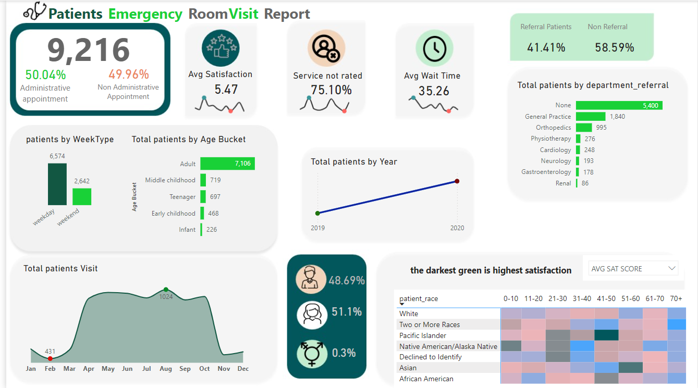

This project provides a comprehensive analysis of **Emergency Room (ER) visits** with a focus on identifying key trends, patient demographics, and satisfaction metrics. The analysis leverages data from the hospital's ER database to provide actionable insights for stakeholders to improve service quality and operational efficiency.

### Key Areas of Insights and Recommendations

- **Category 1:** Patient appointment types and referral patterns.
- **Category 2:** Patient demographics by age, race, and visit timing.
- **Category 3:** Service metrics like satisfaction, wait time, and un-rated services.
- **Category 4:** Trends in patient visits across years and months.

An interactive Power BI dashboard showcasing the trends and metrics is available as part of this project.

---

## Data Structure & Initial Checks

The primary dataset consists of a CSV file containing the following columns:

- **AppointmentType:** Indicates whether the appointment is administrative or non-administrative.
- **ReferralStatus:** Distinguishes between referral and non-referral patients.
- **AgeBucket:** Categorizes patients into age groups (e.g., Infant, Teenager, Adult).
- **PatientRace:** Describes the race/ethnicity of the patients.
- **VisitDate:** Timestamp of each patient visit.
- **SatisfactionScore:** Numerical score for service satisfaction.
- **WaitTime:** Average waiting time for patients.
- **DepartmentReferral:** Department to which the patient was referred.

The dataset contains **9,216 records** and covers patient visits over a span of 2 years.

---

## Executive Summary

### Overview of Findings

The analysis reveals the following key insights:
1. **50.04% of appointments are administrative, while 49.96% are non-administrative.**
2. **Referral patients constitute 41.41% of total visits, while 58.59% are non-referral.**
3. **Adult patients account for 77% of total visits, with the highest satisfaction among older age groups.**
4. **Wait times average 35.26 minutes, with service satisfaction averaging 5.47 out of 10.**

These insights provide a roadmap for improving patient experience, reducing wait times, and optimizing resource allocation.

---

## Insights Deep Dive

### Category 1: Patient Appointment Types and Referral Patterns

- **Main Insight 1:** Administrative appointments account for half of all visits, indicating balanced usage of administrative and clinical resources.
- **Main Insight 2:** Referral patients primarily come from General Practice (5,400 patients) and Orthopedics (995 patients).
- **Main Insight 3:** Non-referral patients tend to visit during weekdays, peaking on Wednesdays.
- **Main Insight 4:** Referral patients show slightly higher satisfaction scores than non-referral ones.

### Category 2: Patient Demographics by Age, Race, and Visit Timing

- **Main Insight 1:** Adult patients dominate the data (7,106 visits), followed by Middle Childhood (719) and Teenagers (697).
- **Main Insight 2:** White patients form the majority of visits, with "Two or More Races" showing the highest satisfaction.
- **Main Insight 3:** Weekend visits are significantly lower (2,642 visits) compared to weekdays (6,574 visits).
- **Main Insight 4:** Visit frequency spikes in August, with an annual increase from 2019 to 2020.

### Category 3: Service Metrics - Satisfaction, Wait Time, and Un-rated Services

- **Main Insight 1:** 75.10% of visits lack a satisfaction score, highlighting a need for better feedback collection.
- **Main Insight 2:** Average satisfaction is 5.47, with the "darkest green" cells indicating the highest scores.
- **Main Insight 3:** Average wait times are 35.26 minutes, with the longest delays recorded in summer months.
- **Main Insight 4:** High wait times correlate with lower satisfaction scores, especially for non-administrative appointments.

### Category 4: Trends in Patient Visits

- **Main Insight 1:** Visits consistently increase year over year, with a notable rise in 2020.
- **Main Insight 2:** Patient volume peaks in August (1,024 visits), likely due to seasonal factors.
- **Main Insight 3:** Satisfaction scores are stable across months but vary by demographic group.
- **Main Insight 4:** Evening hours see higher satisfaction scores compared to mornings and afternoons.

---

## Recommendations

Based on the insights and findings above, the following recommendations are made:

1. **Improve Feedback Collection:** Encourage patients to complete satisfaction surveys, especially for the 75.10% without ratings.
2. **Reduce Wait Times:** Streamline administrative processes to decrease the average wait time of 35.26 minutes.
3. **Optimize Referral Systems:** Focus on high-traffic referral departments like General Practice and Orthopedics.
4. **Target Weekend Engagement:** Increase staff availability or promotional activities to boost weekend visit rates.
5. **Seasonal Resource Planning:** Allocate additional resources during peak months like August.

---

## Assumptions and Caveats

1. **Assumption:** Missing satisfaction scores do not significantly skew the analysis of average satisfaction.
2. **Assumption:** Weekend and weekday visits follow similar patterns across years.
3. **Assumption:** Referral and non-referral patients have comparable demographic distributions.

---
